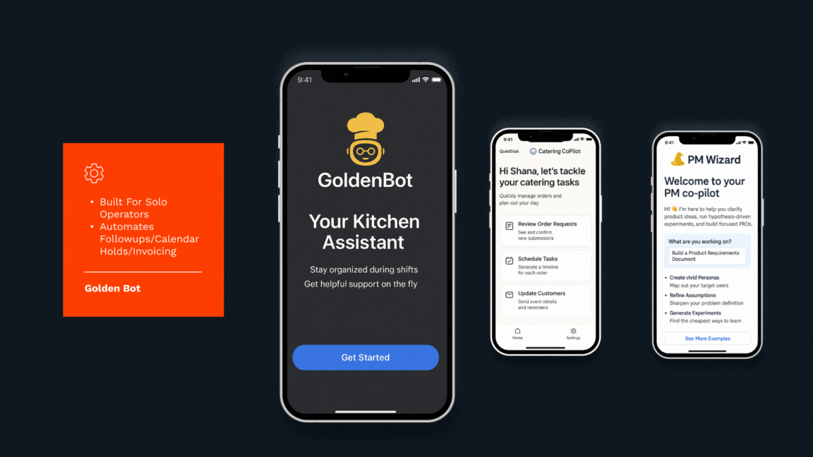

<h1>Hi, I'm Roberto!  <a href="https://www.linkedin.com/in/roberto-bonefont-jr-6a769a23/">AI Product Manager</a>, <a href="https://github.com/">Product Strategist</a>, <a href="https://www.notion.so/">Builder of Quiet Tools</a></h1>

<h2>🧠 Case Study-Driven Product Work</h2>

🎬 QuietStak Case Study Demo

  

A glimpse into QuietStak — designed to reduce ambient noise and cognitive load for knowledge workers using AI-powered focus rituals and smart interruption handling.

- <b>GoldenBot – The AI Assistant for Culinary Entrepreneurs</b>  
  - [First Automation MVP](https://github.com/robertobonefont/goldenbot-case-study)  
    Automates lead follow-up, calendar blocking, and invoice creation for solo chefs. Built with GPT-4, Gmail API, and low-code tools. Purpose built for Solo-preneur chefs that need help managing the back-end and the back of the house. 
    <i>“I can cook for 40 people, but I can’t chase 20 leads…”</i>

- <b>Catering Copilot – AI Assistant for Solo Chefs</b>  
  - [Catering Sector Automation](https://github.com/robertobonefont/goldenbot-case-study)  
    Automates lead response, invoice generation, and calendar blocking using GPT-4, Google suite API, and no-code tools, and a light notion powered data-base. Designed for catering managers that are juggling events and inbox chaos.  
    <i>“How do i run a catering operation and the lead generation and follow up while I'm also executing the events?”</i>

- <b>PM Wizard – Strategic Copilot for Product Leaders</b>  
  - [Product Strategy PRD](https://github.com/robertobonefont/quietstak-case-study/blob/main/🧭%20PM%20Wizard%20PRD%20v1.docx)  
    A personalized GPT assistant for PMs to write better PRDs, test hypotheses faster, Generate realistic personas, and align cross-functional teams using HDD and JTBD frameworks. Integrated with Zapier, Notion, and Slack for async flow.  
    <i>“It’s like pairing with a lead PM who knows what questions to ask anywhere in the product lifecycle.”</i>

- <b>Web-Form Based Ordering System (GSJA)</b>  
  - [Ops Automation](https://github.com/robertobonefont/gsja-crm-automation)  
    Replaced clipboard orderguides with a structured, QR code system that automated ordering pipelines for a high-volume restaurant team. Reduced ordering time by 25%, recovered 4.5 leadership hours/week, empowered whole team to participate in requisition process, virtually eliminated ordering errors and improved product consistency across all restaurants within the portfolio.

- <b>Subscription Pivot: B2B Food Experience (Blossom)</b>  
  - [Research-to-Roadmap](https://github.com/robertobonefont/blossom-subscription-model)  
    Led customer discovery, subscription modeling, and MVP roadmap for a B2B food experience brand pivoting toward monthly enterprise plans. Delivered key insight that shifted pricing strategy and doubled contract conversions in pilot accounts.

---

### 📘 Product Strategy & UX Fluency

I specialize in bringing AI-native products to life through a structured, hypothesis-driven approach. My work blends product intuition with evidence-based iteration — grounded in frameworks like Jobs-To-Be-Done (JTBD) and Hypothesis-Driven Development (HDD).

#### 🔁 Discovery & Strategy
- Jobs-to-Be-Done (JTBD) interviews & framing
- Opportunity Trees & roadmap alignment (à la Teresa Torres)
- Hypothesis-Driven Development (HDD) for lean validation
- Strategic experimentation (smoke tests, fake doors, pilot cohorts)

#### 🎯 UX Research & Design
- Conducting moderated and unmoderated user interviews
- Journey mapping, friction identification, and prototype testing
- UX design in Figma (wireframes to high fidelity)
- Accessibility-first and mobile-first design fluency

#### 🛠️ Tools & Tech Fluency
- **AI/LLM**: GPT-4, RAG, embeddings, Copilot integration
- **Design**: Figma, FigJam, Miro
- **Workflows**: Notion, Zapier, Google Workspace APIs
- **Low-Code**: Airtable, Make (Integromat), Replit, Super.so
- **Research**: Dovetail, Maze, Useberry (light), Otter.ai

#### 🧠 PM Practice
- Product requirement documentation in Notion & GitHub
- Signal-driven iteration (email digests, emoji feedback loops, GPT prompt logging)
- Stakeholder alignment through behavioral personas & success metrics
- Discovery tracking with RICE/ICE/Confidence ratings
---

<h2>📌 Featured Projects</h2>

- <b>Notion-Powered PRD Generator</b>  
  - Internal tool using LLM prompts to capture insights directly into Notion  
  - Speeds up product documentation by ~40%

- <b>Trust Loops for GPT Assistants</b>  
  - Built lightweight signal capture via emoji feedback and digest open tracking  
  - Improves assistant iteration without complex dashboards

---

<h2> 🤝 Connect with Me</h2>

[][linkedin]

[linkedin]: https://www.linkedin.com/in/roberto-bonefont-jr-6a769a23/

---

- 🔭 I’m currently working on: lightweight Agentic AI assistants that remove admin friction from solo workflows  
- 🌱 I’m currently learning: Python and deeper applications of retrieval-augmented generation (RAG) for workflow agents.  
- 👯 I’m looking to collaborate on: tools that can make product management faster, clearer, and more human  
- 🤔 I’m looking for help with: integrating clean user feedback loops into low-code LLM prototypes  
- 💬 Ask me about: agentic UX, Jobs-To-Be-Done in AI products and productivity  
- 📫 How to reach me: roberto@quietstak.com or [LinkedIn](https://www.linkedin.com/in/roberto-bonefont-jr-6a769a23/)  
- 😄 Pronouns: he/him  
- ⚡ Fun fact: Before product strategy, I was a chef and ran hospitality operations. Now I design tools for people who still do.
---

### 📜 Certifications & Professional Training

- ✅ **Agile Development Specialization – University of Virginia (Darden School of Business)**  
  Deep dive into hypothesis-driven development, agile frameworks, and iterative product delivery :[Show Certificate](https://www.coursera.org/account/accomplishments/specialization/9WMESAVKN3ZC)
  
- ✅ **Digital Product Management: Modern Fundamentals – University of Virginia**  
  Focused on product strategy, MVP design, experimentation, and roadmap alignment :[Show Certificate](https://www.coursera.org/account/accomplishments/specialization/MNE7C73YUYH2)

- ✅ **Google UX Design Specialization**  
  Training in user research, personas, wireframing, prototyping (Figma), and usability testing :[Show Certificate](https://www.coursera.org/account/accomplishments/specialization/1VN64MCGWJ63)

- ✅ **Google Project Management Specialization**  
  Covers agile project cycles, stakeholder communication, resource management, and performance tracking :[Show Certificate](https://www.coursera.org/account/accomplishments/specialization/certificate/W9RKFN4TLM5G)

- ✅ **Agentic AI and AI Agents for Leaders Specialization – Vanderbilt University**  
  Completed coursework on designing, leading, and deploying agentic AI systems and GPT-powered agents :[Show Certificate](https://www.coursera.org/account/accomplishments/specialization/4NBFAHBNK3LL)

- ✅ **Product Ideation, Design & Management – University of Maryland**  
  Specialization in integrated product thinking, systems design, and the customer journey :[Show Certificate](https://www.coursera.org/account/accomplishments/specialization/NHTUPFEQ43RJ)

<!--
**robertobonefont/robertobonefont** is a ✨ case-study-driven ✨ profile that reflects HDD, JTBD, and AI-native PM skills. Ask about:
- Product discovery loops
- UX experiments on a budget
- Building PM portfolios from real behavior
-->

<!--
**8Bit-Chef/8Bit-Chef** is a ✨ _special_ ✨ repository because its `README.md` (this file) appears on your GitHub profile.

Here are some ideas to get you started:

- 🔭 I’m currently working on ...
- 🌱 I’m currently learning ...
- 👯 I’m looking to collaborate on ...
- 🤔 I’m looking for help with ...
- 💬 Ask me about ...
- 📫 How to reach me: ...
- 😄 Pronouns: ...
- ⚡ Fun fact: ...
-->
